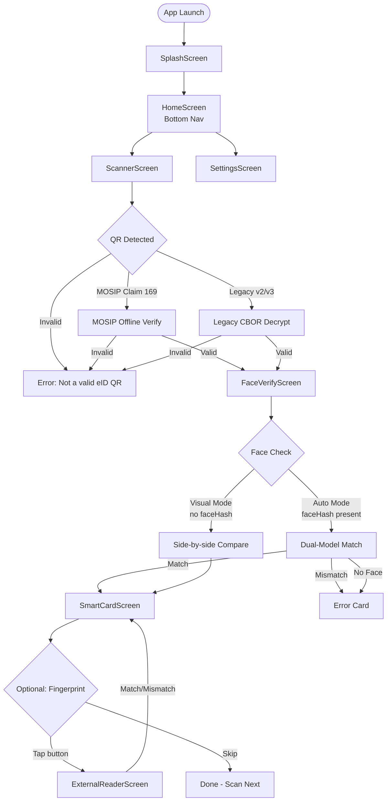
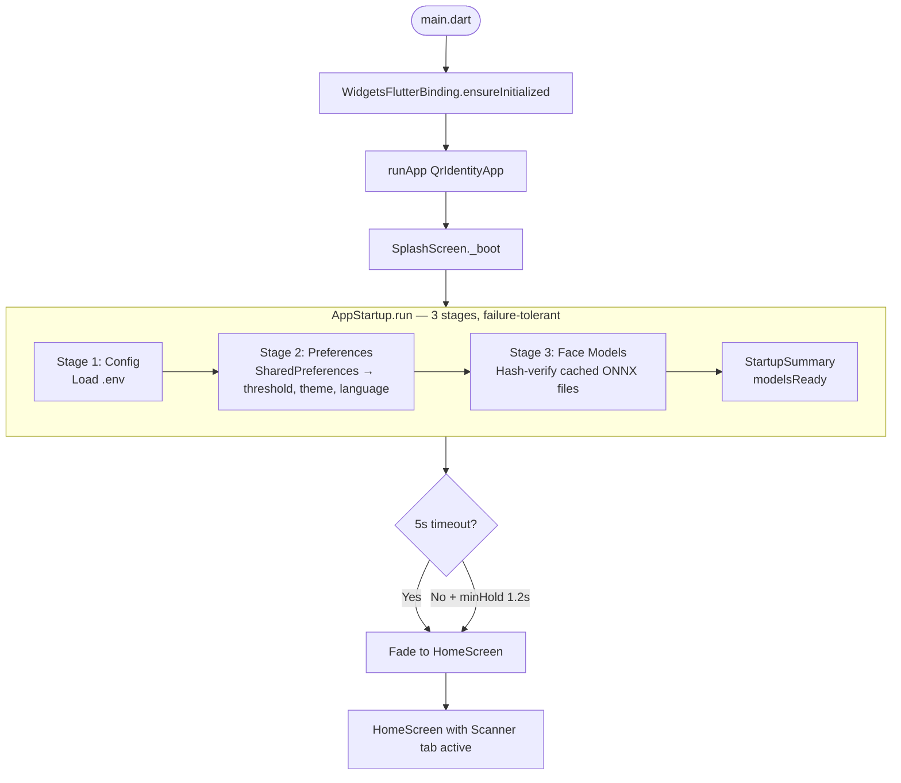
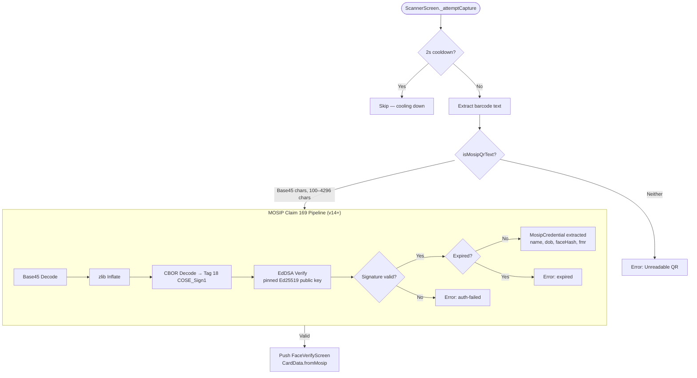
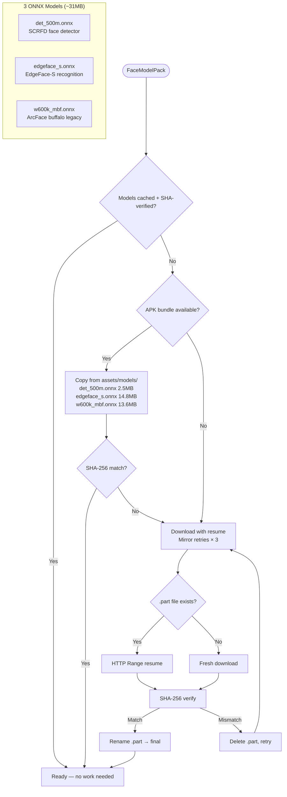
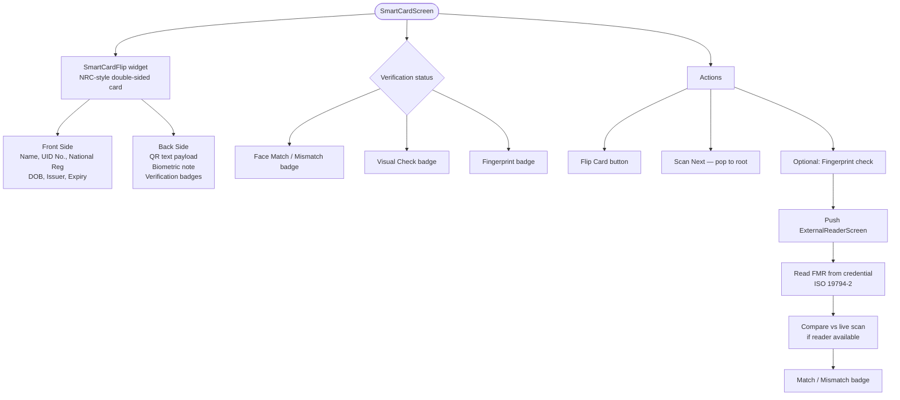
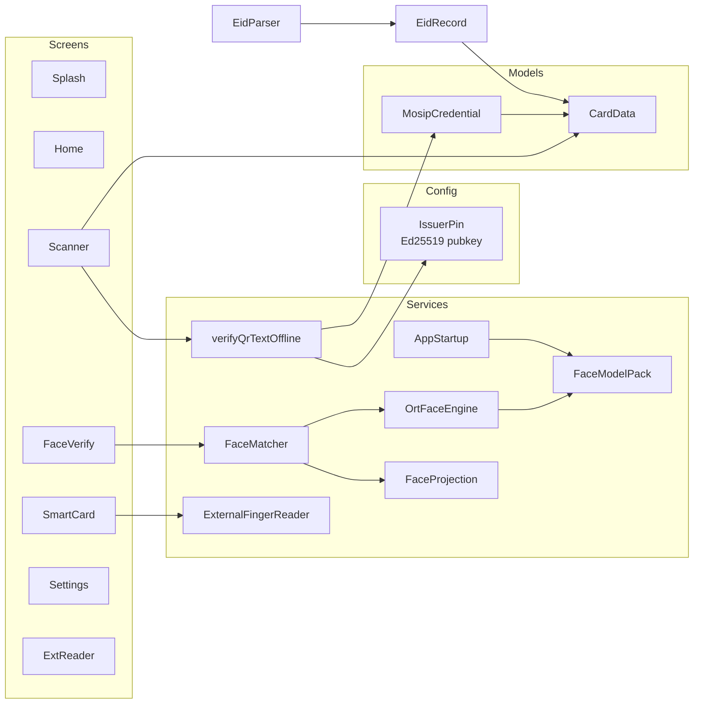
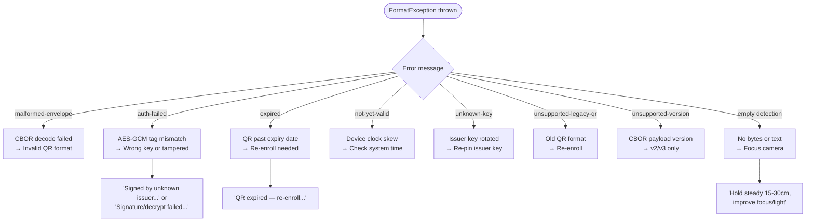

# eID Verify — Architecture Flow

## High-Level User Journey



## App Startup (Cold Boot)



## QR Scanning — v14+ Signed-Only



## Face Verification — Dual-Model Pipeline

```mermaid
flowchart TD
    Face([FaceVerifyScreen]) --> Mode{faceHash present?<br/>Auto or Visual mode}

    Mode -->|Auto| Capture[Capture Selfie<br/>front camera, 1024px, q85]
    Mode -->|Visual| Capture

    Capture --> Selfie{Photo taken?}
    Selfie -->|No| Back[Return to idle]
    Selfie -->|Yes| AutoCheck{Auto mode?}

    AutoCheck -->|Yes| MatchFlow
    AutoCheck -->|No| Visual[Show QR photo vs Selfie<br/>side-by-side]

    subgraph MatchFlow ["FaceMatcher.matchSelfieVsQr"]
        MF1[Open OrtFaceEngine<br/>SCRFD + EdgeFace-S + w600k_mbf] --> MF2[Decode selfie → RGB]
        MF2 --> MF3[SCRFD-500M Detect<br/>640×640 letterbox, thresh 0.5, NMS 0.4]
        MF3 --> MF4[Largest face selected]
        MF4 --> MF5[Similarity Align → 112×112<br/>ArcFace landmark template]
        MF5 --> MF6[EdgeFace-S Embed → 512-d L2-norm]
        MF5 --> MF7[w600k_mbf Embed → 512-d L2-norm]

        MF6 --> MF8{QR template version?}
        MF7 --> MF8

        MF8 -->|v3 68B| MF9[Project 512→64-d<br/>Cosine similarity vs template]
        MF8 -->|v2 132B| MF10[Project 512→128-d<br/>Cosine similarity vs template]
        MF8 -->|v1 65B hash| MF11[Sign-hash comparison<br/>1 - hamming/512]

        MF9 --> MF12[pickMatch<br/>Better margin above threshold wins]
        MF10 --> MF12
        MF11 --> MF12
    end

    MF12 --> Result{Match result?}
    Result -->|Match| ShowCard[Show "Show Card" button]
    Result -->|Mismatch| ErrCard[Error: Score below threshold]
    Result -->|NoFace| ErrFace[Error: No face detected]

    ShowCard --> OpenCard[Push SmartCardScreen]
    Visual --> OpenCard
    ErrCard --> Retry[Retry or retake]
    ErrFace --> Retry
```

## Face Model Pack — On-Device Setup



## Smart Card Display



## Settings & Preferences

```mermaid
flowchart TD
    Settings([SettingsScreen]) --> Theme[Theme Mode<br/>Light / Dark / System]
    Settings --> Lang[Language<br/>Burmese (default) / English]
    Settings --> Threshold[Face Match Threshold<br/>Slider 0.0–1.0<br/>Default: 0.60]
    Settings --> Models[Face Models<br/>Status / Setup / Clear]

    Theme --> |Save| ThemeCtrl[ThemeController.instance<br/>Notifies MaterialApp]
    Lang --> |Save| LangCtrl[LanguageController.instance<br/>Bilingual UI strings]
    Threshold --> |Save| Prefs[SharedPreferences<br/>FaceMatcher.hashThreshold]
    Models --> |Setup| Pack[FaceModelPack.ensureReady<br/>Copy from bundle]
    Models --> |Clear| Clear[FaceModelPack.clear<br/>Delete cached ONNX files]
```

## Service Layer Architecture



## Error Handling Flow


